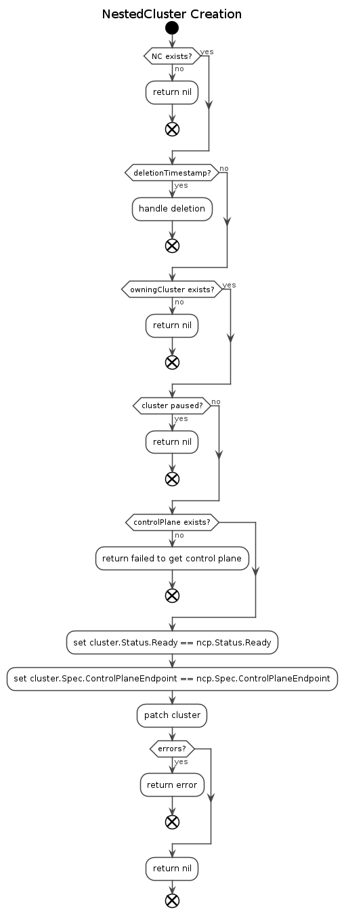
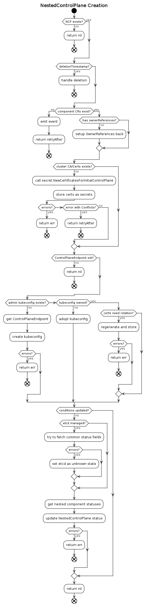

# CAPN NestedCluster & NestedControlPlane

## Table of Contents

<!--ts-->

   * [CAPN NestedCluster &amp; NestedControlPlane](#capn-nestedcluster--nestedcontrolplane)
      * [Table of Contents](#table-of-contents)
      * [Glossary](#glossary)
      * [Summary](#summary)
      * [Motivation](#motivation)
         * [Goals](#goals)
         * [Non-Goals/Future Work](#non-goalsfuture-work)
      * [Proposal](#proposal)
         * [User Stories](#user-stories)
         * [Features from user stories](#features-from-user-stories)
            * [NestedCluster](#nestedcluster)
         * [NestedCluster Lifecycle](#nestedcluster-lifecycle)
            * [NestedControlPlane](#nestedcontrolplane)
         * [NestedControlPlane Lifecycle](#nestedcontrolplane-lifecycle)
            * [Component CustomResources (NEtcd, NKAS, NKCM)](#component-customresources-netcd-nkas-nkcm)
         * [PKI/Certificate Management](#pkicertificate-management)
            * [In-Tree Certificate Management](#in-tree-certificate-management)
            * [ControlPlaneEndpoint Setting](#controlplaneendpoint-setting)
            * [KUBECONFIG Management](#kubeconfig-management)
         * [Risks and Mitigations](#risks-and-mitigations)
      * [Upgrade Strategy](#upgrade-strategy)
         * [Version Skew Strategy](#version-skew-strategy)
      * [Implementation History](#implementation-history)


<!--te-->

## Glossary

Refer to the [Cluster API Provider Nested Glossary](/proposals/00_capn-glossary.md).

If this proposal adds new terms, or defines some, make the changes to the book's glossary when in the PR stage.

## Summary

This proposal outlines the base architecture for Cluster API Provider Nested (CAPN) `NestedCluster` & `NestedControlPlane`. CAPN  enables you to use Cluster API to manage control planes that are run as Pods "nested" within a [super cluster](/proposals/00_capn-glossary.md#super-cluster). These nested control planes, paired with a "sync controller" (PROPOSAL LINK TBD), that allows the super cluster to run workloads that have been scheduled against the CAPN provided control planes.

Doing this allows you to take a multi-tenant super cluster and break it up into multiple single-tenant control planes, thus allowing the users of those control planes the ability to use cluster level resources like CRDs, AdmissionWebhooks, Cluster RBAC and more, while still getting the benefits of utilization of multi-tenant clusters.

## Motivation

This project is based after the work from the [multi-tenancy working group](http://sigs.k8s.io/multi-tenancy) on `virtualcluster`. Virtual cluster was implemented with a component internally called `vc-manager` which allowed you to provision a pod based control plane with the exception of the `kube-scheduler`. The motivation for CAPN is to reimplement this design with CAPI in-mind.

### Goals

- To design a new custom resource definition to orchestrate the creation of the nested control planes.
- To design a new custom resource definition to orchestrate the creation of the "cluster"
- To support declarative orchestrated control plane upgrades for apiserver and controller manager pods in built-in controllers.
- To support managing custom cluster add ons in the CAPN control plane, such as DNS, auth, etc using CAPI's `ClusterResourceSet`.

### Non-Goals/Future Work

Non-goals are limited to the scope of this document, these features will evolve
over time.

- To support managing real nodes in CAPN. _Technically, CAPN can use real nodes. But we have to incorporate an entire new machine provision mechanism/workflow which we leave as the future work._
- To support managing components running in the super cluster worker nodes. _All the node plugins such as Kubeproxy, CNI/CSI will be managed in the super cluster by the super cluster administrator. They cannot be configured through the CAPN APIs._
- To support a separate scheduler in each CAPN control plane. _There are few use cases which require two level schedulers but it is out of the scope for CAPN as of now._ 
- Define how each [component controller](/proposals/00_capn-glossary.md#component-controller) operates, this is defined in [Creating Control Plane Components](/proposals/20201026-creating-control-plane-components.md)


## Proposal

### User Stories

1. As a control plane operator, I want to be able to set the namespace where my cluster is provisioned
1. As a control plane operator, I want to be able to set the name of my control plane
1. As a control plane operator, I want to be able to specify the [component controllers](/proposals/00_capn-glossary.md#component-controller) for my cluster.
1. As a control plane operator, I want CAPN to manage my certificates.
1. As a control plane operator, I want to supply my certificates and PKI.
1. As a control plane operator, I want CAPN to manage my KUBECONFIGs.
1. As a control plane operator, I want CAPN to setup object relationships.
1. As a machine, I want to know how to address my control plane.

### Components

#### NestedCluster

Kubernetes API Group: `infrastructure.cluster.x-k8s.io/v1alpha4`

This resource is responsible for getting the Cluster API `Cluster` type and setting the `spec.controlPlaneRef` pointing back to to this `NestedCluster`, this allows the CAPI controllers to understand the state of the cluster. As well It listens to the `NestedControlPlane` resource which is associated and keeps it's status in sync as the cluster is provided.


```go
type NestedClusterSpec struct {
	// ControlPlaneRef is an optional reference to a provider-specific resource that holds
	// the details for provisioning the Control Plane for a Cluster.
	// +optional
	ControlPlaneRef *corev1.ObjectReference `json:"controlPlaneRef,omitempty"`
	
	// ControlPlaneEndpoint represents the endpoint used to communicate with the control plane.
	// +optional
	ControlPlaneEndpoint clusterv1.APIEndpoint `json:"controlPlaneEndpoint"`
}

type NestedClusterStatus struct {
	// Ready is when the NestedControlPlane has a API server URL.
	// +optional
	Ready bool `json:"ready,omitempty"`
}

type NestedCluster struct {
	metav1.TypeMeta   `json:",inline"`
	metav1.ObjectMeta `json:"metadata,omitempty"`

	Spec   NestedClusterSpec   `json:"spec,omitempty"`
	Status NestedClusterStatus `json:"status,omitempty"`
}
```

### NestedCluster Lifecycle




#### NestedControlPlane

Kubernetes API Group: `controlplane.cluster.x-k8s.io/v1alpha4`

The NestedControlPlane resource is responsible for orchestrating the overarching cluster, this controller doesn't create any of the downstream objects instead it creates a place where the downstream objects can look up shared values.

```go
type NestedControlPlaneSpec struct {
	// ControlPlaneEndpoint represents the endpoint used to communicate with the control plane.
	// +optional
	ControlPlaneEndpoint clusterv1.APIEndpoint `json:"controlPlaneEndpoint"`
    
	// EtcdRef is the reference to the NestedEtcd 
	EtcdRef *corev1.ObjectReference `json:"etcd,omitempty"` 
    
	// APIServerRef is the reference to the NestedAPIServer 
	// +optional
	APIServerRef *corev1.ObjectReference `json:"apiserver,omitempty"` 
    
	// ContollerManagerRef is the reference to the NestedControllerManager
	// +optional
	ControllerManagerRef *corev1.ObjectReference `json:"controllerManager,omitempty"`
}

type NestedControlPlaneStatus struct {
	// Etcd stores the connection information from the downstream etcd 
	// implementation if the NestedEtcd type isn't used this
	// allows other component controllers to fetch the endpoints.
	// +optional
	Etcd *NestedControlPlaneStatusEtcd `json:"etcd,omitempty"`

	// APIServer stores the connection information from the control plane
	// this should contain anything shared between control plane components
	// +optional
	APIServer *NestedControlPlaneStatusAPIServer `json:"apiserver,omitempty"`
    
	// Initialized denotes whether or not the control plane has the
	// uploaded kubernetes config-map.
	// +optional
	Initialized bool `json:"initialized"`
    
	// Ready denotes that the AWSManagedControlPlane API Server is ready to
	// receive requests and that the VPC infra is ready.
	// +kubebuilder:default=false
	Ready bool `json:"ready"`
    
	// ErrorMessage indicates that there is a terminal problem reconciling the
	// state, and will be set to a descriptive error message.
	// +optional
	FailureMessage *string `json:"failureMessage,omitempty"`
    
	// Conditions specifies the cpnditions for the managed control plane
	Conditions clusterv1.Conditions `json:"conditions,omitempty"`
}

type NestedControlPlaneStatusEtcd struct {
	// Addresses defines how to address the etcd instance
	Addresses []NestedEtcdAddress `json:"addresses,omitempty"`
}

type NestedControlPlaneStatusAPIServer struct {
	// ServiceCIDRs which is provided to kube-apiserver and kube-controller-manager
	// +optional
	ServiceCIDR string `json:"serviceCidr,omitempty"`
}
```

### NestedControlPlane Lifecycle



#### Component CustomResources (NEtcd, NKAS, NKCM)

After the controller has fetched the `NestedControlPlane` resource and that it's not in a terminating state it will look for all the [Nested* Component Controllers](20201026-creating-control-plane-components.md). It will do this by following the `*Refs` defined on the `NestedControlPlaneSpec`. Once all of the Nested* component Custom Resources have been found the controller will patch these objects setting the `metadata.ownerReferences` back to the `NestedControlPlane`.

```go
if err := controllerutil.SetControllerReference(ncp, component, r.scheme); err != nil {
    // Return errors
}
```


### PKI/Certificate Management

Within a CAPN Cluster we need to manage the certificates and CA's which are used for the components in the control plane, this MUST be done outside of each of the component controllers so that we can share this information. As well these should be overridable by supplying your own certificates using `cert-manager` or other solutions by the use of shared common Kubernetes secret names.

#### In-Tree Certificate Management

When the `NestedControlPlane` controller receives a new `NCP` resource it first goes through checks to validate that the necessary resources have been created first. In these checks it will look to see if the cluster CA and initial certificates have been issued. These are looked up in the management cluster via Kubernetes secrets as per [Using Custom Certificates](https://cluster-api.sigs.k8s.io/tasks/certs/using-custom-certificates.html?highlight=certificate#using-custom-certificates) with the addition


| Name                   | Type     | Example                                               |
| ---------------------- | -------- | ------------------------------------------------------------ |
| *[cluster name]***-ca**  | CA       | openssl req -x509 -subj "/CN=Kubernetes API" -new -newkey rsa:2048 -nodes -keyout tls.key -sha256 -days 3650 -out tls.crt |
| *[cluster name]***-etcd** | CA       | openssl req -x509 -subj "/CN=ETCD CA" -new -newkey rsa:2048 -nodes -keyout tls.key -sha256 -days 3650 -out tls.crt                                                          |
| *[cluster name]***-proxy** | CA       | openssl req -x509 -subj "/CN=Front-End Proxy" -new -newkey rsa:2048 -nodes -keyout tls.key -sha256 -days 3650 -out tls.crt                                                           |
| *[cluster name]***-sa**  | Key Pair | openssl genrsa -out tls.key 2048 && openssl rsa -in tls.key -pubout -out tls.crt |
| *[cluster name]***-[component]-client-cert** | Key Pair       | openssl genrsa -out tls.key 2048 && openssl rsa -in tls.key -pubout -out tls.crt  |

If these secrets aren't found, the controller will attempt to create these using the funcs from `kubeadm` and CAPI. These funcs will check if the secrets exist, if they do not they generate the certificates and save them.

```go
certificates := secret.NewCertificatesForInitialControlPlane(&kubeadmv1.ClusterConfiguration{})
controllerRef := metav1.NewControllerRef(kcp, controlplanev1.GroupVersion.WithKind("NestedControlPlane"))
if err := certificates.LookupOrGenerate(ctx, r.Client, util.ObjectKey(cluster), *controllerRef); err != nil {
	// Log errors, Set Certificate Condition, Return
}
// Set Certificate Condition 
```

The only addition to the default CA and SA certificates that are generated are the key pairs for each component, if there is not a secret found using the format `*[cluster name]***-[component]-client-cert**` then one will be created for those components using the defined CA. The  possible `component` names are as follows but not limited to:

* etcd
* proxy
* controller-manager
* kubelet
* TBD

#### ControlPlaneEndpoint Setting

After the certificates for the cluster have been found or generated we then need to check if the `ControlPlaneEndpoint` is set, if not we need to return and wait for the endpoint to be available. _Setting the `ControlPlaneEndpoint` field on the `NestedControlPlane` CR should be done by the `NestedAPIServer` resource._

#### KUBECONFIG Management

After the controller has checked that the `ControlPlaneEndpoint` is set, it moves on to verifying the `KUBECONFIG` has been created. To do this the controller will lookup the Secret again, `[cluster name]-kubeconfig`, If the secret is NOT found the controller will begin to generate the `KUBECONFIG` using the Cluster API `kubeconfig` helper functions.

```go
createErr := kubeconfig.CreateSecretWithOwner(
	ctx,
	r.Client,
	clusterName,
	endpoint.String(),
	controllerOwnerRef,
)
```

If the `KUBECONFIG` secret did exist the controller will check it's ownership, if it's missing owner references the kubeconfig will be `adopted` and owned by this control plane. Following ownership checks it will verify that the `KUBECONFIG` certificates are still valid, following CAPI's design this will default to 1 year expiry and a 6 month rotation timing, if those need rotation that operation will be done and the secret is updated.

```go
needsRotation, err := kubeconfig.NeedsClientCertRotation(configSecret, certs.ClientCertificateRenewalDuration)
if err != nil {
	// Return errors
}

if needsRotation {
	if err := kubeconfig.RegenerateSecret(ctx, r.Client, configSecret); err != nil {
		// Return errors
	}
}
```

## Upgrade Strategy

Both `NestedCluster` & `NestedControlPlane` resources aren't actually responsible for the upgrading of the physical components, this is left to the downstream component controllers. When they receive an updated CR for `NestedEtcd` or `NestedAPIserver` those controllers are responsible for keeping the control planes updated. The `NestedControlPlane` and `NestedCluster` both need to be kept in-sync if update do happen to make sure `spec.controlPlaneEndpoint` is still pointed at the right access.

The exception to this rule is the certificate management, because the control planes get their certificates through the `NestedControlPlane` controller creating the artifacts and storing in Kubernetes secrets (if not supplied) then we need to make sure the secrets receive that same updated secret when the certificates expire and are renewed, this is an action the component controllers MUST watch for but COULD be triggered via NCP.


### Version Skew Strategy 

Version skew is a problem that can easily happen, since the NCP doesn't prescribe the overall version of the stack, these must be managed manually by the individual component controllers and any updates that happen should be synced back through the Nested* CRs where necessary (eg. sync control plane endpoint, etcd addresses, etc.)

## Implementation History

- [x] 10/21/2020: Proposed idea in an issue or [community meeting]
- [x] 01/11/2021: Compile a Google Doc following the CAEP template (link here)
- [ ] MM/DD/YYYY: First round of feedback from community
- [ ] MM/DD/YYYY: Present proposal at a [community meeting]
- [ ] MM/DD/YYYY: Open proposal PR

<!-- Links -->
[community meeting]: https://docs.google.com/document/d/10aTeq2lhXW_3aFQAd_MdGjY8PtZPslKhZCCcXxFp3_Q/edit#heading=h.ejz1103gmaij


