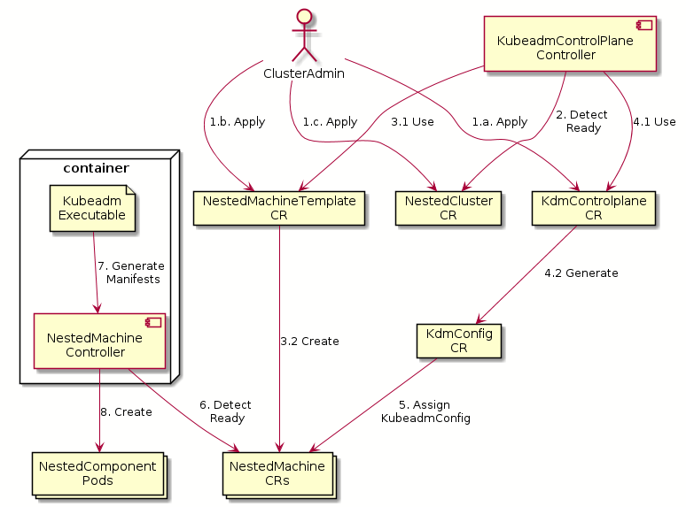

# Using KubeadmControlPlane Provider For CAPN

## Table of Contents

* [Using KubeadmControlPlane Provider For CAPN](#using-kubeadmcontrolplane-provider-for-capn)
   * [Table of Contents](#table-of-contents)
   * [Glossary](#glossary)
   * [Summary](#summary)
   * [Motivation](#motivation)
      * [Goals](#goals)
      * [Non-Goals/Future Work](#non-goalsfuture-work)
   * [Proposal](#proposal)
      * [Templating the Control Plane](#templating-the-control-plane)
      * [User Stories](#user-stories)
      * [Implementation Details](#implementation-details)
   * [Implementation History](#implementation-history)

## Glossary

Refer to the [Cluster API Book Glossary](https://sigs.k8s.io/cluster-api-provider-nested/docs/proposals/00_capn-glossary.md).

If this proposal adds new terms, or defines some, make the changes to the book's glossary when in PR stage.

## Summary

Today, with CAPN when you provision your Pod based control plane we have implemented a completely bespoke `ControlPlaneProvider` called the `NestedControlPlane`. The `NestedControlPlane` uses a set of three "nested components" each defining a single component of the control plane, `kube-apiserver` as `NestedAPIServer`, `kube-controller-manager` as `NestedControllerManager` and `etcd` as `NestedEtcd` these allow each component to design it's own spec. Having three nested components makes the CAPI provider bespoke and difficult for a new user that has CAPI experience to translate their existing cluster specs into a nested architecture.

After spending time evaluating CAPI's in-tree `KubeadmControlPlaneProvider` we think this provider can give us the base components necessary using the standardized KubeadmControlPlane spec to generate the necessary pod objects. 

## Motivation

- Alignment with CAPI core components
- Enable `Kubeadm` based specs for templating the control plane

### Goals

- Reuse `KubeadmControlPlane`(KubeadmControlPlane) for CAPN component configurations

### Non-Goals/Future Work

- Implement `NestedMachine`'s this will be documented and implemented in an additional CAEP
- Use `KubeadmControlPlane` to do health checking, this comes with the `NestedMachine`

## Proposal

### Templating the Control Plane

In this section, we will focus on the details of how to templating the control plane and would not discuss the details of how `NestedMachine` controller works. To use `kubeadm` based specs, we can import the entire `k8s.io/kubernetes` repository as a module and call related functions under `kubeadm` package, while it is not recommended to import `k8s.io/kubernetes` as a module. We can also copy the functions/structs from the `k8s.io/kubernetes` repository; however, those functions/structs are deeply nested, which includes thousands of lines of code. Therefore, to reuse the `kubeadm` functionalities, we bake `kubeadm` binary into the container image of the `NestedControlPlane` controller, generate the manifests at runtime and share them with the `NestedControlPlane` controller through the container filesystem. 

Assume that we have installed the `KubeadmControlPlaneController`, the `NestedMachineController`, and all necessary CAPI controllers on the management cluster. We have also imported the `kubeadm` packages from the `kubernetes` module. Then, the templating process will include the following steps.

1. The user applies the `KubeadmControlPlane` CR and all other necessary CAPI CRs.
2. The `KubeadmControlPlane` controller keeps checking if the `NestedCluster` CR is ready.
3. If yes, the `KubeadmControlPlane` controller use the `NestedMachineTemplate` to creates desired number of `NestedMachines` for the `NestedCluster` Infrastructure.
4. The `KubeadmControlPlane` controller generates the `KubeadmConfig` CR based on the `KubeadmControlPlane` created in the first step. 
5. The `KubeadmControlPlane` controller assigns the `KubeadmConfig` to the owned `NestedMachine` CR by setting the ObjectReference.
6. The `NestedMachine` controller keeps checking if the `KubeadmConfig` has been assigned to the `NestedMachine` CR.
7. If yes, the `NestedMachine` controller executes the `kubeadm` executable to generate the static pod template.
8. The `NestedMachine` controller decorates the static pod template with the proper volume mounts and creates the raw pod objects, which allows the `KubeadmControlPlane` to manage these pods.

### User Stories

1. As a user, I would like to have all my control plane components using standardized KubeadmControlPlane spec.
1. As a user, I would like to customize the command line arguments of my `NestedControlPlane`'s components through a `KubeadmControlPlane` CR.
2. As a user, I would like to customize the pod volumes of my `NestedControlPlane`'s components through a `KubeadmControlPlane` CR.

### Implementation Details

The provisioning of the control plane requires the involvement of the `NestedMachine` controller. We will discuss the `NestedMachine` controller and the complete provisioning process in another CAEP. 
This CAEP will focus on how to template the control plane in a more "CAPI" way, i.e., using `KubeadmControlPlane` provider and `kubeadm` libs from the `kubernetes` module.  

- Bake the `kubeadm` executable into the container image of the `NestedControlPlane` controller.
- Use the existing `NestedControlPlane` implementation for testing, which uses the NestedKASController, NestedKCMController and the NestedEtcdController.
- Create `KubeadmConfig` CR manually.
- Implement the generic functionality of extracting the`kubeadmapi.ClusterConfig` from the `KubeadmConfig` CR.
- Generate a config file that will be used by the `kubeadm` to generate the manifests.
- Before adopting any nested component, `NestedControlPlane` will run the `kubeadm` binary to generate the static pod template for each component and create a configmap to store them.
- Then the nested component controllers will use the static PodSpec to create the template of the StatefulSet. 

## Implementation History

- [x] 07/21/2021: Propose idea in an issue or [community meeting]
- [x] 07/21/2021: Open proposal PR
- [x] 08/17/2021: Revise the proposal based on the feedbacks 
- [x] 07/28/2021: Reimplement the templating process based on the proposed idea

<!-- Links -->
[community meeting]: https://docs.google.com/document/d/1Ys-DOR5UsgbMEeciuG0HOgDQc8kZsaWIWJeKJ1-UfbY
