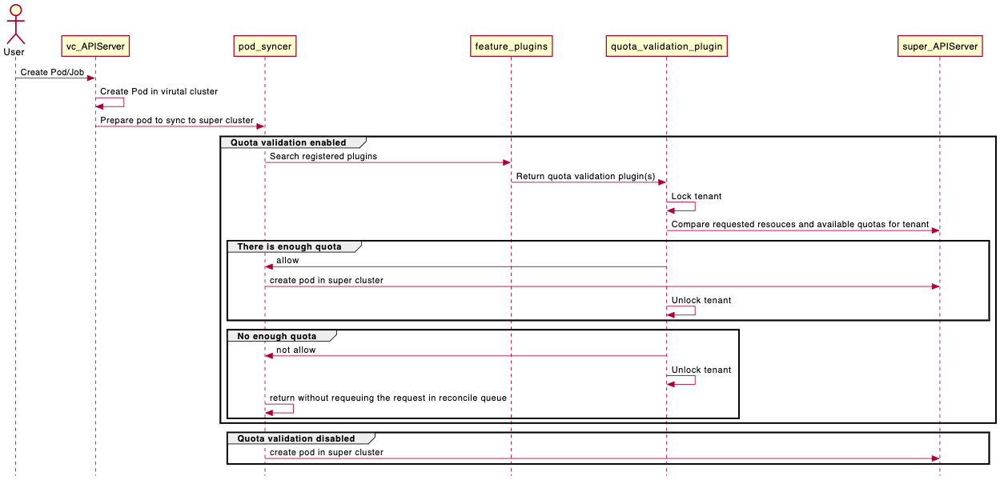

# Adding Quota Validation Plugin in Pod Syncer


## Table of Contents

<!--ts-->

   * [Adding Quota Validation Plugin in Pod Syncer]
      * [Table of Contents](#table-of-contents)
      * [Glossary](##glossary)
      * [Summary](##summary)
      * [Motivation](##motivation)
         * [Goals](###goals)
         * [Non-Goals](###non-goalsk)
      * [Proposal](##proposal)
         * [User Stories and Requiremments](###user-stories-and-requirements)
         * [Implementation Details](###implementation-details)
         * [Security Model](###security-model)
         * [Risks and Mitigations](###risks-and-mitigations)
      * [Alternatives](##alternatives)
      * [Implementation History](##implementation-history)


<!--te-->

## Glossary

Refer to the https://github.com/kubernetes-sigs/cluster-api-provider-nested/blob/main/docs/proposals/00_capn-glossary.md

## Summary

Resource Quota is a widely used mechanism to reduce resource contention and guarantee SLO in a multi-tenant cluster. Current Multi-tenant Virtual Cluster implementation does not include quota management. In this proposal, we suggest to use pod syncer to validate the quota before letting tenant’s resource being deployed onto super cluster, and introduce a dynamic plugin in the syncer to allow users to inject their own validation logics without touching community code.

## Motivation

* Per namespace quota admission control is not suitable for multi-tenant virtual cluster environment. This is because It requires tenant to coordinate with super cluster admin to create namespaces and setup quotas in advance. It also forces super cluster admin to map namespaces with tenants in order to control overall quota usage for each tenant.
* Cross namespace and per tenant overall quota admission control provides a true virtual cluster experience for tenant. It allows tenant freely creating/updating/deleting namespaces with guarantee of not breaking  resource quota allowance in super cluster. It also reduce resource fragmentation in tenant space. 
* Cross namespace quota admission control needs a centralized engine to validate resource creation. Traditional approach is to use validation Webhook. However, using Webhook in multi-tenant cluster environment has following issues:
    * for a Webhook installed in tenant virtual cluster: as tenants have admin privileges in their virtual cluster, the quota validation Webhook can be deleted by tenant and is not a truly enforced mechanism.
    * for a Webhook installed in super cluster: it becomes a bottle neck for all tenants and impacts multiple threading model implemented in pod syncer.
* Given quota admission control is a proprietary implementation for different cloud environments. Providing an universal solution is not pratical. This is why in this document we propose to build a plugin to let users to easily integrate their quota validation logics into pod-syncer.

### Goals

* Propose a quota validation plugin for user to integrate custom quota management functions into pod-syncer.
* Define per tenant locking mechanism in pod-syncer to preserve parallel processing of tenants’ requests and prevent race condition while checking quota usage.
* Give an example of quota validation plugin registration and initialization.

### Non-Goals

* Queuing mechanism used for managing pods that exceeds quota limit.
* Define design and implementations for quota provision, quota validation and quota usage tracking.

## Proposal

### User Stories and Requirements

* As a cluster admin, I want to enforce tenant overall quota usage in super cluster so that tenant can freely create namespace and manage separate quota in virtual cluster.
* As a cluster admin, I want to enable cross namespace quota admission control in super cluster so that resource fragementation can be minimized.
* As a cluster admin, I want to define own quota validation implementation and easy integration into pod-syncer
* As a tenant, I want my resource requests are being processed in parallel with requests from noisy tenants so that performance interferences and contentions can be minimized.

### Implementation Details

Given virtual cluster syncer a unique place that aggregates and processes all tenants’ requests through fair queuing,  we think the best place to validate quota is in pod-syncer. This is because:

* pod-syncer has all knowledge of namespace/tenant mapping, resource usage status and resource request details.
* All kind resource requests, e.g. through job creation, deployment, or from replica-set, all end up being processed in pod-syncer, which reduce the capturing and converting different resource requests.
* pod-syncer has all privilege of controlling resources in super cluster, able to hold tenant’s pod in pending state, and re-queue the pending pods periodically.
* the syncer has unique queuing mechanism that allows locking of one tenant in a short period of time without interfering other tenants.


Following diagram depicts how the validation plugin works together with pod-syncer.

When pod syncer reconciler receives pod creation request:

* it first checks if quota validation flag is on, if not, it goes ahead with normal pod creation procedure.
* if quota validation flag is on, pod-syncer searches for quota validation plugin that is dynamically registered at syncer starting time, and call the quota validation plugin
* the pod-syncer first locks tenant, then calls the quota validation plugin and if the validation is successful the pod syncer will create the pod in super cluster and removes the per tenant lock.
* if not successful, the per tenant lock will be released. The creation reconcile routine can return with no-requeue option, so the pod will not be putting back into reconcile queue immediately. The un-synced pod will be in pending state. The pod-syncer patroller will re-queue the pending pod later. 


**Validation Plugin**

A ValidationPluginInterface will be defined to present all types of validation plugins. Users' custom quota validation plugin will be derived from it.

```
type ValidationPluginInterface interface {
   GetName() string   
   ValidationPlugin(*client.Object, string) bool   
   GetTenantLocker(clusterName string) *Tenant
}
```

A generic plugin registration module will be created in syncer to allow user to register their own plugins.

```
type Plugin struct {
   Registration *Registration // registration, as initialized   
   instance     interface{}
   err          error
}
```

```
type Registration struct {
   ID string   // ID of the plugin   
   
   // InitFn is called when initializing a plugin. The registration and context are passed in.   
   InitFn func(*mc.MultiClusterController) (interface{}, error)
   
   Disable bool  // Disable the plugin from loading   
}
```

The quota validation plugin is initialized when pod-syncer controller getting created in pkg/syncer/resource/pod/controller.go

```
func NewPodController(config *config.SyncerConfiguration, client clientset.Interface,   informer informers.SharedInformerFactory,   vcClient vcclient.Interface,   vcInformer vcinformers.VirtualClusterInformer,   options manager.ResourceSyncerOptions) (manager.ResourceSyncer, error) {
...
plugins := featureplugin.DefaultFeatureRegister.List()
for _, p := range plugins {
    if p.ID == "quotavalidationplugin" {
        pp, _ := p.Init(c.MultiClusterController).Instance()
        c.plugin = pp.(featureplugin.ValidationPluginInterface)
        break
    }
}
...
}
```

Users need to register their costom quota validation logic in init function:

```
func init() {

    featureplugin.DefaultFeatureRegister.Register(&featureplugin.Registration{
        ID: QuotaValidationPlugin,
        InitFn: func(mccontroller *mc.MultiClusterController) (interface{}, error) {
            return NewQuotaManager(mccontroller, isFake)
        },
        Disable: true,
    })
}
```

**Quota Validation**

The registered quota validation plugin is called in pod-syncer ( pkg/syncer/resource/pod/dws.go):

```
func (c *controller) reconcilePodCreate(clusterName, targetNamespace, requestUID string, vPod *v1.Pod) error {

newObj, err := c.Conversion().BuildSuperClusterObject(clusterName, vPod)
if c.plugin != nil {
            if !(c.plugin).ValidationPlugin(&newObj, clusterName) {
               return fmt.Errorf("cannot create pod due to exceeding quota limit")   
            }
            
            
pPod := newObj.(*v1.Pod)
...
            
pPod, err = c.client.Pods(targetNamespace).Create(context.TODO(), pPod, metav1.CreateOptions{})

...
}
```


**Per Tenant Lock**

Current multi-tenant syncer dispatches requests into per tenant queue. The syncer fetches request from these queues  in a round robin fashion using multiple threads.

The quota validation logic needs to serialize pod creation for each tenant in super cluster in order to get accurate used quota measurement and prevent race conditions. A per tenant lock is defined to perform the serialization.

```
type Tenant struct {
   TenantName  string //same as virtual cluster name   
   Cond        *sync.Mutex
   }
```

Per tenant lock is invoked before the quota validation is called in “reconcilePodCreate” function of pod syncer:

```
func (c *controller) reconcilePodCreate(clusterName, targetNamespace, requestUID string, vPod *v1.Pod) error {
...
if c.plugin != nil {
            t := (c.plugin).GetTenantLocker(clusterName)
            if t == nil {
                return errors.NewBadRequest("cannot get tenant")
            }
            t.Cond.Lock()
            defer t.Cond.Unlock()
            if !(c.plugin).ValidationPlugin(&newObj, clusterName) {
                ...
        }
    }
...
pPod, err = c.client.Pods(targetNamespace).Create(context.TODO(), pPod, metav1.CreateOptions{})
...
}
```

The per tenant lock allows syncer to process requests in parallel for different tenants.

#### Tenant Map

A tenant map can be kept in quota validation plugin

```
type Quotaplugin struct {
   Name string     
   alltenants map[string]Tenant   
   *sync.RWMutex
}
```

A read lock will be used when getting tenant record from tenant map. A write lock is needed when tenant map gets updated periodically (every 2 hour or longer).

### Security Model

* By putting all quota configuration in super cluster and not syncing the configuration upward or downward, tenant cannot modify quota limits.
* By adding quota validation in pod-syncer, quota enforcement operations are transparent to tenant, 
* With 1) per tenant queue in syncer, 2)  round robin request fetching model,  3) plus per tenant locking mechanism used for quota validation plugin, all these guarantees that tenants have a fair amount of processing time, no performance contention with noisy tenant.

### Risks and Mitigations

A quota validation flag will be introduced to enable the quota validation plugin. By default the flag is set to disabled so all plugin logic will be bypassed.


## Alternatives

#### Quota Validation Webhook in Super Cluster

A validation webhook can be installed in super cluster to check quotas usage for tenants. The Webhook needs the knowlodge of tenant, namespace, virtual cluster mapping in order to perform the checking. These information needs to be fetched from Syncer in real time, which adds complexity and reduces efficiency.


## Implementation History

*  01/16/2022: Proposed idea in an issue (#240) or [community meeting](https://docs.google.com/document/d/1Ys-DOR5UsgbMEeciuG0HOgDQc8kZsaWIWJeKJ1-UfbY)
*  02/02/2022: Compile a Google Doc following the CAEP template (link here)
*  MM/DD/YYYY: First round of feedback from community
*  MM/DD/YYYY: Present proposal at a [community meeting](https://docs.google.com/document/d/1Ys-DOR5UsgbMEeciuG0HOgDQc8kZsaWIWJeKJ1-UfbY)
*  MM/DD/YYYY: Open proposal PR


