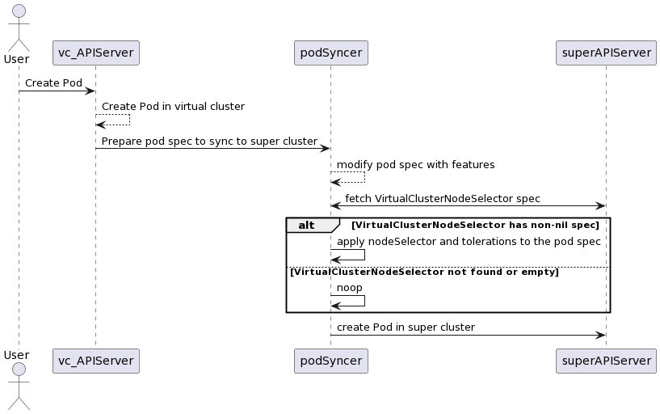

# Adding Global Node Selector in Pod Syncer

## Table of Contents

<!--ts-->

* [Adding Quota Validation Plugin in Pod Syncer]
    * [Table of Contents](#table-of-contents)
    * [Glossary](##glossary)
    * [Summary](##summary)
    * [Motivation](##motivation)
        * [Goals](###goals)
        * [Non-Goals](###non-goalsk)
    * [Proposal](##proposal)
        * [User Stories and Requiremments](###user-stories-and-requirements)
        * [Implementation Details](###implementation-details)
        * [Security Model](###security-model)
        * [Risks and Mitigations](###risks-and-mitigations)
    * [Alternatives](##alternatives)
    * [Implementation History](##implementation-history)


<!--te-->

## Glossary

Refer to the https://github.com/kubernetes-sigs/cluster-api-provider-nested/blob/main/docs/proposals/00_capn-glossary.md

## Summary

NodeSelector is a widely used mechanism to assign pods to specific node groups providing isolation and predictability of schedule. Current Multi-tenant Virtual Cluster implementation does not have any control over it. In this proposal, we suggest having a VirtualClusterNodeSelector object to tell PodSyncer to apply nodeSelector to every pod created in the virtual cluster.

## Motivation

- The current implementation does not allow to have a fully-isolated virtual cluster, by assigning its workload to the specific nodes without any knowledge about superCluster
- Operators of the VirtualCluster can use nodeSelectors right now, but they have no visibility of what labels exist in the superCluster
- Operators of the VirtualCluster have no control over control-plane scheduling, which should be isolated on the same nodes too

### Goals

- Propose VirtualClusterNodeSelector isolation mechanism for a user to integrate it into pod-syncer and cluster provisioner
- Define the sufficient structure of the VirtualClusterNodeSelector object to control pod-syncer and cluster provisioner behaviour and cover all pod scheduling cases
- Implement pod-syncer and cluster provisioner mechanisms that respect the VirtualClusterNodeSelector object and modify pod scheduling.

### Non-Goals/Future Work

- Super Cluster node labelling and aggregation are not covered here, and it is assumed that we already have nodes with different labels in the supercluster
- Usage of different schedulers is covered in different docs

## Proposal

### User Stories

- As a cluster admin, I want to allow tenants (if they need to) to have isolated virtual clusters and isolate them from any other workload (for performance, security or special needs)
- As a cluster admin, I want to define my nodeSelector implementation to have control over isolation
- As a tenant, I want to ensure that all my workload, including the control plane, is scheduled on my group of nodes if I requested isolation.

### Implementation Details/Notes/Constraints

Given virtual cluster syncer a unique place that aggregates and processes all tenants’ pods in a fair queue,
we think it is the best place to assign nodeSelector to pods there, during the downward sync.
Control Plane is not using a pod syncer and is deployed through the cluster provisioner, so it should be modified in the same manner as the pod syncer.

The following diagram depicts how the node selector should work with the pod-syncer


So, when the pod syncer (the flow for the cluster provisioner is the same, so we don't duplicate ourselves here) gets a new pod to sync to supercluster it:
1. Checks if VirtualClusterNodeSelector exists and has a non-nil spec.
2. If the object is absent or has an empty spec - nothing is done, meaning the virtual cluster should not be isolated and the pod could be scheduled with common rules.
3. If the object exists and is non-empty - the pod syncer takes its spec and applies it to the pod spec, changing its nodeSelector and tolerations fields

```go
package v1alpha1

type VirtualClusterNodeSelector struct {
    metav1.TypeMeta   `json:",inline"`
    metav1.ObjectMeta `json:"metadata,omitempty"`
    
    Spec   VirtualClusterNodeSelectorSpec   `json:"spec,omitempty"`
}
type VirtualClusterNodeSelectorSpec struct {
	// NodeSelector is a selector which must be true for the pod to fit on a node.
	// Selector which must match a node's labels for the pod to be scheduled on that node.
	// More info: https://kubernetes.io/docs/concepts/configuration/assign-pod-node/
	// +optional
	NodeSelector map[string]string `json:"nodeSelector,omitempty"`
	// If specified, list of taints that should be tolerated in pod spec
	// to assign to NoSchedule nodes for better isolation
	// +optional
	Tolerations []corev1.Toleration `json:"tolerations,omitempty"`
}
```

### Security Model

* By putting all VirtualClusterNodeSelector configurations in supercluster and not syncing the configuration upward or downward, a tenant cannot modify isolation without having additional instruments.
* By adding NodeSelector apply in pod-syncer, isolation operations are invisible to a tenant, but available for fast and easy check for the supercluster admin.
* By adding NodeSelector apply in pod-syncer and virtual cluster provisioner, a tenant has no way to break isolation and use other node groups

### Risks and Mitigations

- The default behaviour would be the same if VirtualClusterNodeSelector is not found or empty, but it still adds a +1 super cluster API request to check the object's existence
- The additional object (as VirtualClusterQuota) will be added to the super-cluster, so we need to ensure we implement enough cleaners and finalizers in the maintenance controllers.
- There is the risk to create VirtualClusterNodeSelector for non-existing nodes, breaking the virtual cluster creation, but a filling of VirtualClusterNodeSelectors is not covered by this proposal and should be implemented in other ways.

## Alternatives

* Usage of nodeSelectors and tolerations manually by a tenant. This case does not cover control-plane isolation and gives too much flexibility for tenants to break the isolation.
* Usage of a flag for pod-syncer instead of VirtualClusterNodeSelector could do the job, but has less flexibility for different tenants and environments (even if we have a map in this flag - we still need to redeploy pod syncer each time we want to add a new node selector)

## Upgrade Strategy

1. Deployment of pod syncer and cluster provisioner with these changes should not change anything if VirtualClusterNodeSelector objects do not exist.
2. Create VirtualClusterNodeSelector objects according to our needs and test virtual cluster creation and pod assignments.

## Implementation History

- [ ] MM/DD/YYYY: Proposed idea in an issue or [community meeting]
- [ ] MM/DD/YYYY: Compile a Google Doc following the CAEP template (link here)
- [ ] MM/DD/YYYY: First round of feedback from the community
- [ ] MM/DD/YYYY: Present proposal at a [community meeting]
- [x] 09/23/2022: Open proposal PR

<!-- Links -->
[community meeting]: https://docs.google.com/document/d/1Ys-DOR5UsgbMEeciuG0HOgDQc8kZsaWIWJeKJ1-UfbY
