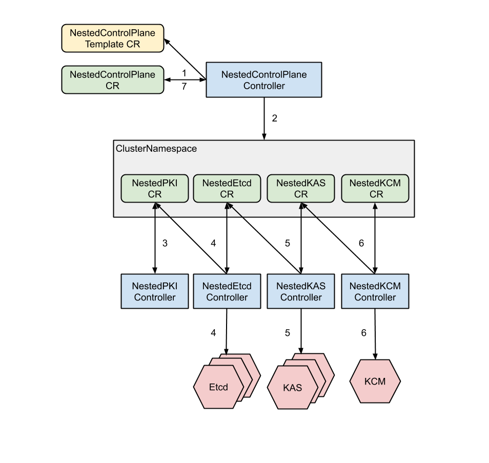

# Creating Control Plane

## Table of Contents

A table of contents is helpful for quickly jumping to sections of a proposal and for highlighting
any additional information provided beyond the standard proposal template.
[Tools for generating](https://github.com/ekalinin/github-markdown-toc) a table of contents from markdown are available.

- [Title](#title)
  - [Table of Contents](#table-of-contents)
  - [Glossary](#glossary)
  - [Summary](#summary)
  - [Motivation](#motivation)
    - [Goals](#goals)
    - [Non-Goals/Future Work](#non-goalsfuture-work)
  - [Proposal](#proposal)
    - [Bootstrap](#bootstrap)
    - [Creation](#creation)
    - [Update](#update)
    - [Deletion](#deletion)
    - [Control Plane Custom Resources](#control-plane-custom-resources)
      - [NestedEtcd CRD](#nestedetcd-crd)
      - [NestedKAS CRD](#nestedkas-crd)
      - [NestedKCM CRD](#nestedkcm-crd)
    - [Security Model](#security-model)
  - [Alternatives](#alternatives)
  - [Implementation History](#implementation-history)

## Glossary

Refer to the [Cluster API Book Glossary](https://cluster-api.sigs.k8s.io/reference/glossary.html).

The followings are terms that will be used in the proposal. Whether including them into the Glossary needs further discussion:

* **Super Cluster** - The underlying cluster that manages the physical nodes, all pods created through the NestedControlPlanes will run on this cluster.
* **Super Master** - The control plane of the super cluster.
* **NestedControlPlane(NCP)** - The control plane that is hosted on the super cluster. 
* **NestedControlPlaneTemplate(NCPT)** - NCPT contains all information required to create the NCP.
* **NestedPKI(NPKI)** - NPKI includes TLS certificates and kubeconfigs required by components of the NCP.
* **NestedEtcd(NEtcd)** - The etcd that belongs to the control plane of the nested cluster.
* **NestedKAS(NKAS)** - The kube-apiserver which belongs to the control plane of the nested cluster.
* **NestedKCM(NKCM)** - The kube-control-manager which belongs to the control plane of the nested cluster.

## Summary

The goal of this proposal is to define a basic/native way of creating control plane 
components~(kube-apiserver~(KAS), Etcd, kube-controller-manager~(KCM)) for the CAPN.

## Motivation

CAPN aims at providing control-plane level isolation while sharing physical resources 
among control planes. There exist various ways of creating isolated control-planes. 
For example, one can create NCPs through cloud providers' Kubernetes services or has 
a separate cluster, just running NCPs. However, the most straightforward way is directly 
running the nested control-plane components on the underlying clusters. In this proposal, 
we present a way of hosting the nested control-plane on the underlying clusters. By 
using the proposed mechanism, the user can set up the CAPN environment on any standard 
Kubernetes cluster without using any third-party platforms or resources.

### Goals

- Define the CRD of each nested component.
- Define how NEtcd, NKAS and NKCM controllers cooperate to create components of NCP.

### Non-Goals

- Define how NCP controller works.
- Define how NPKI controller works.
- Define a mechanism/interface that is portable to other existing controllers, e.g., etcd-operator.

## Proposal

### Bootstrap

The NCP controller will need to create some resources before sub-controllers 
start creating the real control plane components. 

* **ClusterNamespace** is used to store all resources for the NCP.

* **NKAS service**  is used to visit the NKAS. Since IP/domain 
name is required when generating TLS certificates and kubeconfigs of NKAS, this 
service needs to be created in advance.

* **NestedCRs** includes NPKI, NEtcd, NKAS, and NKCM. The NCP controller needs to 
create all CRs for sub-controllers. Among them, NEtcd, NKAS, and NKCM will be 
created based on the NCPT referred by the NCP.

After creating the above prerequisites, sub-controllers will start creating the workload of each component.

### Creation

By default, we will use the StatefulSet to create each component. The readiness 
and liveness probe will be used, and we will mark each component as ready only 
when the corresponding Statefuleset is ready. As the KAS cannot work without 
available Etcd and the KCM cannot run without KAS, the three components need to 
be created in the order of NEtcd, NKAS, and NKCM

Each component CRD contains a Template field that defines the pod template. The 
NCP controller will generate the pod template based on the corresponding addon 
object defined in the corresponding NCPT. For the first implementation, we will 
create a set of templates in this repository. In the future, we plan to support 
using templates from some well-known projects, e.g., kubeadm.


The creating process will include six steps:


1. The NCP controller notices the creation of a new NCP CR.
2. NCP controller creates ClusterNamespace, NPKI, NEtcd, NKAS, NKCM, and the NKAS service.
3. NPKI controller generates TLS certificates for NEtcd and NKAS, creates two kubeconfigs, 
    * a kubeconfig for users/controllers to access the NKAM 
    * a kubeconfig for NKCM to talk to the NKAM 
and marks the NPKI as ready once all certificates and kubeconfigs are created.

4. NEtcd controller creates the NEtcd StatefulSet and a headless service~(as the 
NKAS will only visit the NEtcd from inside the cluster) that exposes the NEtcd. 
Once the NEtcd StatefulSet is ready, the NEtcd controller marks the NEtcd as ready.

5. NKAS controller starts creating the NKAS workload once the NEtcd is ready. 
Same as above, we mark the NKAS as ready once the NKAS StatefulSet is ready.

6. Once the NKAS CR is marked ready, the NKCM controller starts creating the NKCM StatefulSet.
7. After all three components are ready, the NCP controller sets the NCP CR as 
ready if there is no other addson~(e.g., some cluster may require CoreDNS to be 
ready for a ready control plane).

### Update

During the runtime, each sub-controller will watch the workload's status, i.e., 
StatefulSet, managed by it, and update the CR status correspondingly. For example, 
if the NKAS StatefulSet is not ready after several failed liveness probes, the 
NKAS controller will mark the NKAS CR as not ready.

As the pod template of each nested component is based on an NCPT, while an NCPT is a cluster-wide 
resource, to ensure the code integrity, if pod templates need to be updated, one will need to 
create a new NCPT that points to updated [Addon objects](https://github.com/kubernetes-sigs/cluster-addons/blob/2e11794e1ca1e267cd0724f9c4b66a891237acd8/installer/pkg/apis/config/v1alpha1/types.go#L34)
, then update the corresponding NCP CR to refer the new NCPT. Finally, the NCP controller will 
update the Template of the corresponding nested component's CR.

### Deletion

The NCP can be deleted by removing the NCP CR, the NCP controller will then removed 
CRs of all nested components, and the corresponding sub-controller will release 
associating resources.

### Control Plane Custom Resources 

The followings are CRDs of the three components.

### NestedEtcd CRD

```go
// NestedEtcdSpec defines the desired state of NestedEtcd
type NestedEtcdSpec struct {
    // The NestedPKI that provisions certificates for the NestedEtcd
    NestedPKI *corev1.ObjectReference `json:nestedPKI,omitempty`

    // Template defines the podTemplate of the NestedEtcd
    Template corev1.PodTemplateSpec `json:"template"`

    // Number of replicas of the Etcd workload
    // +kubebuilder:default=1
    Replicas int32 `json:"replicas"`
}

// NestedEtcdStatus defines the observed state of NestedEtcd
type NestedEtcdStatus struct {
    // Ready is set if all resources have been created
    Ready bool `json:"ready,omitempty"`

    // EtcdDomain defines how to address the etcd instance
    Addresses []NestedEtcdAddresses `json:"addresses,omitempty"`
}

// NestedEtcdAddresses defines the observed addresses for etcd
type NestedEtcdAddresses struct {
    // IP Address of the etcd instance.
    // +optional
    IP string `json:"ip,omitempty"`
    
    // Hostname of the etcd instance
    Hostname string `json:"hostname,omitempty"`
    
    // Port of the etcd instance
    // +optional
    Port int32 `json:"port"`
}

// NestedEtcd is the Schema for the nestedetcds API
type NestedEtcd struct {
    metav1.TypeMeta   `json:",inline"`
    metav1.ObjectMeta `json:"metadata,omitempty"`
    
    Spec   NestedEtcdSpec   `json:"spec,omitempty"`
    Status NestedEtcdStatus `json:"status,omitempty"`
}
```

### NestedKAS CRD

```go
type NestedKASSpec struct {
    // NestedPKI that provisions certificates for the NestedEtcd
    // +optional
    NestedPKI  *corev1.ObjectReference `json:nestedPKI,omitempty`

    // NestedEtcd that will be connected by the NestedKAS
    // +optional
    NestedEtcd *corev1.ObjectReference `json:nestedEtcd,omitempty`
   
    // Tempaltes defines the podTemplate of the KAS workload
    // +optional
    Template   corev1.PodTemplateSpec `json:template,omitempty`
    
    // Number of replicas of the KAS workload
    // +kubebuilder:default=1
    Replicas   int32
}

// NestedKASStatus defines the observed state of NestedKAS
type NestedKASStatus struct {
    // Ready is set if all resources have been created
    // +kubebuilder:default=false
    Ready bool `json:"ready,omitempty"`
    
    // EtcdDomain defines how to address the etcd instance
    // +optional
    KASService *corev1.Service `json:"addresses,omitempty"`
}

// NestedKAS is the Schema for the NestedKASs API
type NestedKAS struct {
    metav1.TypeMeta   `json:",inline"`
    metav1.ObjectMeta `json:"metadata,omitempty"`
    
    Spec   NestedKASSpec   `json:"spec,omitempty"`
    Status NestedKASStatus `json:"status,omitempty"`
}
```

### NestedKCM CRD

```go
// NestedKCMSpec defines the desired state of NestedKCM
type NestedKCMSpec struct {
    // NestedPKI that provisions certificates for the NestedEtcd
    // +optional
    NestedPKI  *corev1.ObjectReference

    // NestedKAS that will be connected by the NestedKCM
    // +optional
    NestedKAS  *corev1.ObjectReference

    // Tempaltes defines the podTemplate of the KCM workload
    // +optional
    Template   corev1.PodTemplateSpec

    // Number of replicas of the KCM workload
    // +kubebuilder:default=1
    Replicas   int32
}

// NestedKCMStatus defines the observed state of NestedKCM
type NestedKCMStatus struct {
    // Ready is set if all resources have been created
    Ready bool `json:"ready,omitempty"`
}

// NestedKCM is the Schema for the NestedKCMs API
type NestedKCM struct {
    metav1.TypeMeta   `json:",inline"`
    metav1.ObjectMeta `json:"metadata,omitempty"`
    
    Spec   NestedKCMSpec   `json:"spec,omitempty"`
    Status NestedKCMStatus `json:"status,omitempty"`
}
```

### Security Model

Creating an NCP requires the end-user to submit a creation request, and the 
cluster administrator will be responsible for creating the NCP CRs and applying 
them. Once the NCP is ready, the cluster administrator will return a kubeconfig 
to the end-user, as each end-user can only access the apiserver assigned to he/she. 
There is no need to worry about malicious users to manipulate other users' resources. 
A malicious user can still skew the system by creating a massive amount of resources. 
To avoid this, we need to enhance the syncer component; however, this topic is 
beyond this proposal's scope. The proposed mechanism will not lead to any 
severe security issue.

## Alternatives

Users may implement their own NCP controller that provisions master components 
through a third-party platform. For example, users can have an on-premise super 
cluster and a bunch of NCP hosted on the public computing platform.

## Implementation History

- [ ] MM/DD/YYYY: Proposed idea in an issue or [community meeting]
- [ ] MM/DD/YYYY: Compile a Google Doc following the CAEP template (link here)
- [ ] MM/DD/YYYY: First round of feedback from community
- [ ] MM/DD/YYYY: Present proposal at a [community meeting]
- [ ] MM/DD/YYYY: Open proposal PR
